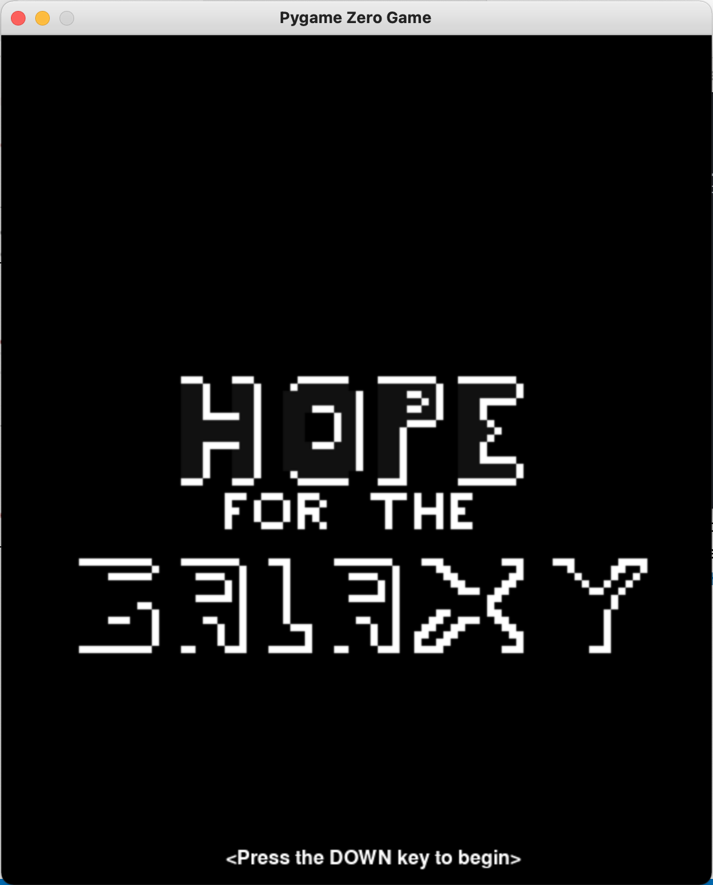
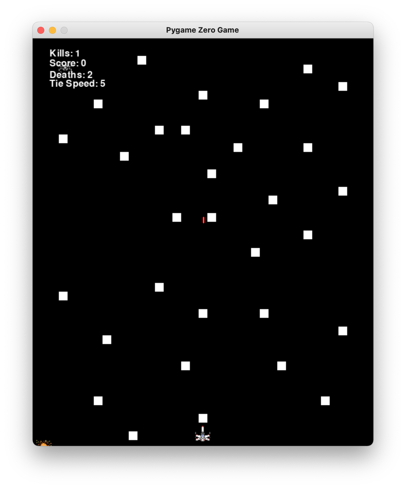

# Hope For the Galaxy Classic
### Contents
- [About](#about)
  - [Screenshots](#screenshots)
- [How to Play](#how-to-play)
- [Issues, Bugs, and Suggestions](#issues-bugs-and-suggestions)

---

### About
Hope For the Galaxy Classic is a simplified version of the Pygame Zero game [Hope For The Galaxy](https://github.com/peternielsen112/hopeforthegalaxy). It's much smaller - about 14% of the size of the original game (in lines of code, [main.py](./main.py)). It also uses less images and has no music.
**Screenshots**

The start screen

Gameplay

**Contribute**

This game does not currently accept contributions. However, head over to [Hope For The Galaxy Original](https://github.com/peternielsen112/hopeforthegalaxy) or email me at [dirigo112@gmail.com](mailto:dirigo112@gmail.com) to offer your services.

---

### How to Play

Use the left and right arrow keys to move your ship left or right. Use the spacebar to fire a laser.

---

### Issues, Bugs, and Suggestions
Unfortunately, because this game is meant to be a small, basic version of Hope For the Galaxy, this version is not accepting suggestions. However, if you run into any bugs or issues, you can report them on [this Github Repo's Issues Page](https://github.com/peternielsen112/hftgclassic/issues).